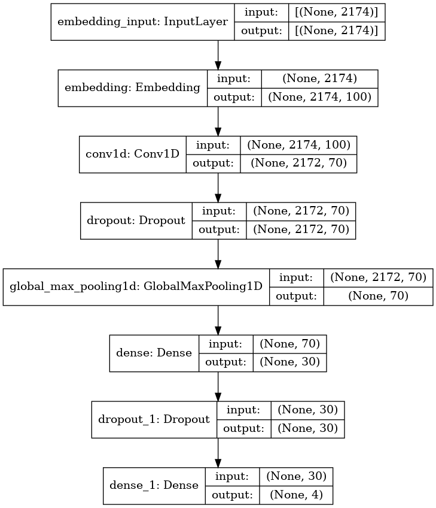

# Assignment 6 - Text classification using Deep Learning
**Christoffer Kramer**  
**20-04-2021**  
 In class this week, we've seen how deep learning models like CNNs can be used for text classification purposes. For your assignment this week, I want you to see how successfully you can use these kinds of models to classify a specific kind of cultural data - scripts from the TV series Game of Thrones.  
You can find the data here: https://www.kaggle.com/albenft/game-of-thrones-script-all-seasons In particular, I want you to see how accurately you can model the relationship between each season and the lines spoken. That is to say - can you predict which season a line comes from? Or to phrase that another way, is dialogue a good predictor of the season?  
Start by making a baseline using a 'classical' ML solution such as CountVectorization + LogisticRegression and use this as a means of evaluating how well your model performs. Then you should try to come up with a solution that uses a DL model, such as the CNNs we went over in class.  

## Methods
This repository consists of two models: a logistic regression classifier and a convolutional neural network (CNN). I started out trying to predict the season based on the lines spoken, however, I later tried to predict, which house a concatenated version of the house members dialogue belongs to. I’m doing this by concatenating all lines spoken by characters, who share the same last name (house name), by episode. Then, using this input, both models are trained to predict, which house the dialogue belongs to.  

## Convolutional neural network (cnn-GOT.py / run_cnn-GOT.sh)

### How to run  
This should work on both Linux, Mac, and Windows. However, if you are running on a
local windows machine, you should run it from a bash emulator such as git bash.  

**Step 1 - Clone repo:**  
- open terminal  
- Navigate to destination for repo  
- type the following command  
```console
git clone https://github.com/Chris-Kramer/lang101_assignment_6.git
```  
**Step 2 - Navigate to the assignment folder:**  
- Navigate to the folder "lang101_assignment_6".  
```console
cd lang101_assignment_6
```  
**Ste 3 - Run bash script:**  
- Use the bash script _run_cnn-GOT.sh_ to set up environment, install dependencies, download and unzip the glove embeddings, and run the cnn model:  
```console
bash run_cnn-GOT.sh
```  
### Running on windows without a bash emulator  
If you're running on a local window machine, and don't have a bash emulator, you must set up a virtual environment, activate it, upgrade pip, install dependencies (requirements.txt). After this, you need to download and unzip the glove embeddings from http://nlp.stanford.edu/data/glove.6B.zip in the folder “glove” (which is located in the data folder). Then you can run the python script manually from the src folder. 

### Output  
The CNN model will print a classification report to the terminal, save a plot over its performance, and save a picture of its architecture in the folder “output”.  
NOTE: If you’re running on a windows machine, the script might not save an image of the architecture, since pydot doesn’t always play well with windows.  

### Parameters:
The parameters fits in the following architecture:
  
  
The parameters for cnn are the following:
- `--n_episodes` How many episodes a house at least should appear in.  
    - DEFAULT: 50  
- `--test_size` The size of the test data as a percentage. The training size will be adjusted automatically.  
    - DEFAULT: 0.2  
- `--padding` The padding type to be used when preprocessing data.  
    - DEFAULT: post  
- `--num_words` How many unique words the embedding dictionary should contain.  
    - DEFAULT: 10000  
- `--embedding_dim` How many embedding dimensions should the embedding matrix contain? Remember to use an appropriate embedding file!  
    - DEFAULT: 100  
- `--pretrained_embeddings` Which of the Glove pretrained embeddings should be used? The embedding file must be located in the folder "data/glove".  
    - DEFAULT: glove.6B.100d.txt  
- `--l1` The learning rate for L1 regularization (used in the first dense layer called "Dense" on the picture above).  
    - DEFAULT: 0.0001
- `--l2` The learning rate for L2 regularization (used in the Conv1D layer).  
    - DEFAULT: 0.0001  
- `--trainable` Should the embeddings be trainable? Can only be True or False.  
    - DEFAULT: True  
- `--filters` How many filters should there be in the Conv1D and hidden dense layer. The input is a list of ints. The first value represents the filters for the Conv1D layer while the second value is the first Dense layer.  
    - DEFAULT: 70 30  
- `--dropout_rate` The dropout rate for the first and second layer. The input is a list of floats. The first value represents the dropout rate for the first dropout layer, while the second value represents the dropout rate for the second layer.  
    - DEFAULT: 0.2 0.2  
- `--epochs` Amount of epochs the model should run.  
    - DEFAULT: 25  
- `--batch_size` The batch size for training and evaluation.  
    - DEFAULT: 10  

#### Example:  
_With bash script:_
```console
bash run_cnn-GOT.sh --n_episodes 60 --test_size 0.1 --embedding_dim 50 --pretrained_embeddings glove.6B.50d.txt 
```
_Without bash script:_  
```console
python cnn-GOT.py --n_episodes 60 --test_size 0.1 --embedding_dim 50 --pretrained_embeddings glove.6B.50d.txt
```  
### Logistic regression classifier (logistic_regression_GOT.py / run_logistic_regression_GOT.sh)  
### How to run  
This should work on both Linux, Mac, and Windows. However, if you are running on a local windows machine, you should run it from a bash emulator such as git bash.  
- Once you’ve cloned the repo and navigated to the correct folder, run the bash script “run_logistic_regression.sh” to set up venv, install dependencies and run the script:  
```console
bash run_logistic_regression_GOT.sh
```  
### Running on windows without a bash emulator
If you're running on a local window machine, and don't have a bash emulator, you must set up a virtual environment, activate it, upgrade pip, install dependencies (requirements.txt), and then run the python script manually from the src folder.  

### Output
The logistic regression classifier will print a classification report to the terminal, save a confusion matrix, and save a plot with results from cross-validation, which will be in the folder “output”.  

### Parameters
The parameters for logistic regression are the following: 
- `n_episodes` How many episodes should a house at least should appear in.  
    - DEFAULT: 50  
- `test_size` The size of the test data as a percentage. The training size will be adjusted automatically.  
    - DEFAULT: 0.2  
- `n_splits` The number of shufflesplits during the cross validation.  
    - DEFAULT: 50  

#### Example:  
_With bash script:_  
```console
bash run_logistic_regression_GOT.sh --n_episodes 60 --test_size 0.1 --n_splits 40
```  
_Without bash script:_  
```console
python logistic_regression_GOT.py --n_episodes 60 --test_size 0.1 --n_splits 40
```  